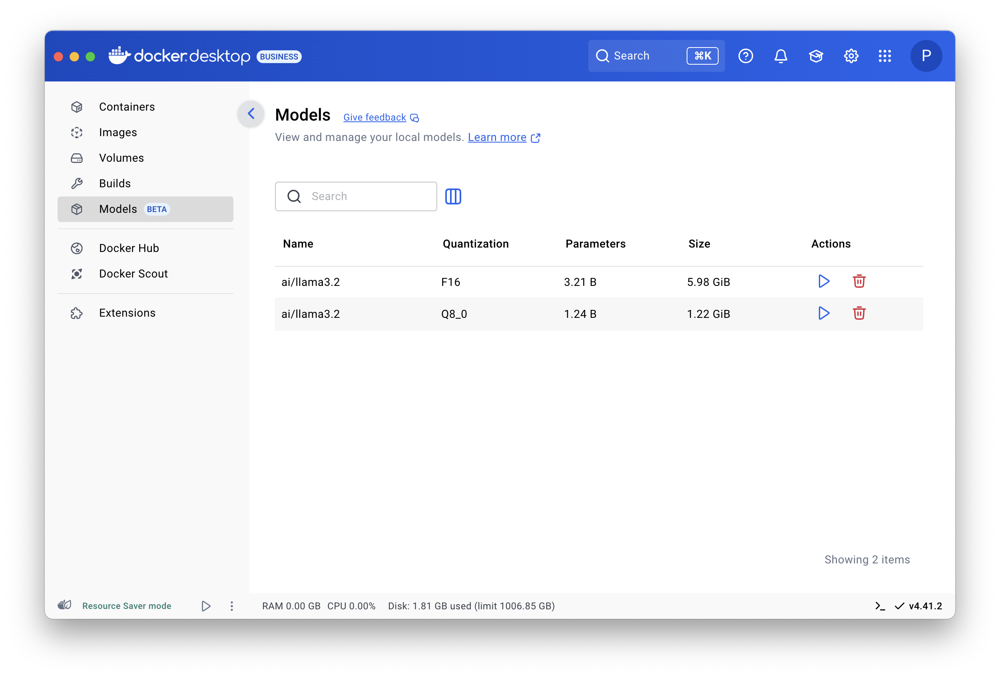

# ¿Ollama killer?, Modelos de IA en Docker Desktop 
Sin duda Ollama es la herramienta más popular para ejecutar modelos de IA en local, pero Docker ha lanzado una nueva funcionalidad que permite ejecutar modelos de IA de forma sencilla e integrada en Docker Desktop.

En este artículo, exploraremos cómo ejecutar modelos de IA como Llama o deepseek en Docker Desktop, gracias a la nueva funcionalidad de docker model. ¿Estará a la altura?

Ya estuve hablando de esta funcionalidad durante su fase beta en este vídeo: https://youtu.be/RPrZXQiIy_k

Su mayor limitación era una ausencia de interfaz práctica para modelos y que solo funcionaba en Mac. Tras solventar esto, ahora podemos ejecutar modelos de IA en Docker Desktop de forma sencilla y rápida.

## Requisitos
- Docker Desktop 4.41 o superior
- 8 Gb de RAM


## Descargar un modelo en Docker Desktop
Para descargar un modelo, simplemente ejecutamos el siguiente comando:

```bash
docker model pull <nombre del modelo>
```

Otra novedad es que ahora tenemos una sección de modelos en el Docker Hub, donde podemos ver los modelos disponibles y su documentación.

Puedes acceder a esta sección en el siguiente enlace: https://hub.docker.com/catalogs/models

Tras descargar el modelo, podemos utilizar la sección de docker desktop para ver los modelos que tenemos disponibles.



## Ejecutar un modelo
Para ejecutar un modelo, simplemente ejecutamos el siguiente comando:

```bash
docker model run <nombre del modelo>
```
En este caso, el modelo se ejecutará en modo interactivo y nos permitirá interactuar con él a través de la terminal.

También podríamos ejecutar el modelo con un prompt de entrada, por ejemplo:

```bash
docker model run <nombre del modelo> --prompt "¿Cuál es la capital de España?"
```
Esto nos permitirá obtener una respuesta del modelo sin necesidad de interactuar con él a través de la terminal.


## Ejemplos de aplicaciones utilizando modelos
Para esta parte, docker ha creado tres ejemplos de chats sencillos que interactúan con los modelos de IA proporcionados por docker.

Los tenemos en el siguiente repositorio: https://github.com/docker/hello-genai

Podemos ejecutar los ejemplos de la siguiente manera:

```bash
chmod +x run.sh
./run.sh
```

Este script realiza un pull del modelo necesario y ejecuta las diferentes aplicaciones de chat. Puedes acceder a ellas a través de la siguiente URL: http://localhost:8080, http://localhost:8081 y http://localhost:8082

También puedes editar el modelo a utilizar cambiando los valores del fichero `.env` que por defecto son los siguientes:

```bash
# Configuration for the LLM service
LLM_BASE_URL=http://model-runner.docker.internal/engines/llama.cpp/v1

# Configuration for the model to use
LLM_MODEL_NAME=ai/llama3.2:1B-Q8_0
```


## Conclusiones
Docker ha lanzado esta nueva funcionalidad que sin duda facilitará la vida a muchos desarrolladores que quieran experimentar con modelos de IA sin necesidad de tener un entorno complejo o complicado.

Si que echo en falta poder utilizarlo en Docker Engine sobre servidores linux, pero no dudo en que lo veremos muy pronto. 

Espero que este artículo te haya sido útil y que te animes a probar esta nueva funcionalidad de Docker Desktop.

Un abrazo y nos vemos en el siguiente.

